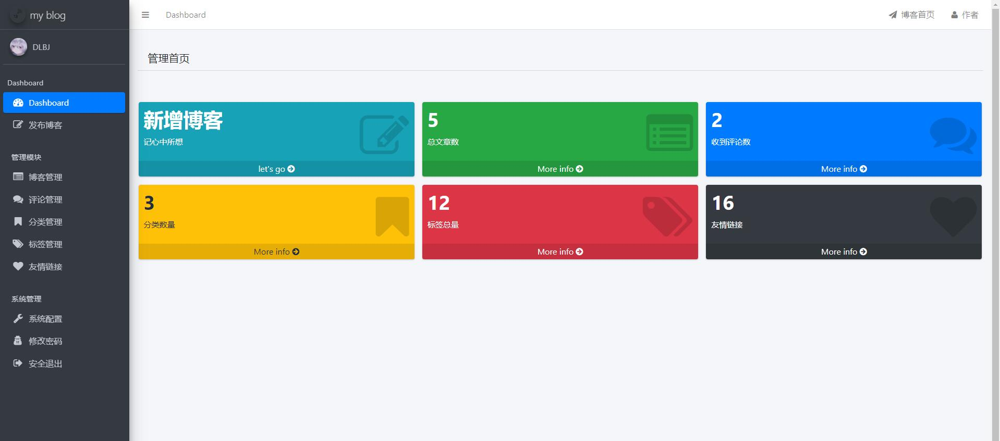
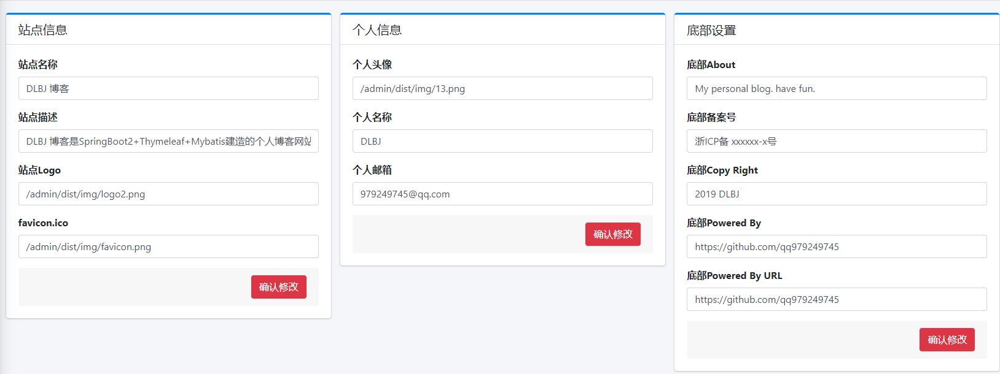

# My Blog


**坚持不易，各位朋友如果觉得项目还不错的话可以给项目一个 star 吧，也是对我一直更新代码的一种鼓励啦，谢谢各位的支持。**

## 注意事项

- **数据库文件目录为```static-files/my_blog_db.sql```；**
- **My Blog 还有一些不完善的地方，鄙人才疏学浅，望见谅；**
- **有任何问题都可以反馈给我，我会尽量完善该项目。**

演示站点：http://b.donglibajiu.cn

## 联系作者

> 大家有任何问题或者建议都可以在 [issues](https://github.com/qq979249745/myblog/issues) 中反馈给我，我会慢慢完善这个项目。

- 我的邮箱：979249745@qq.com

## 效果预览

### 后台管理页面

- 登录页

	

- 后台首页

	

- 文章管理

	

- 文章编辑

	

- 评论管理

	

- 系统配置

	
